# CSUN ECE 524L Fall 2021
## Lab 7 - Design Space Exploration of FIR Filter 

**Report Created by:**
- Group 2 
- Joseph Barchanowicz
- Morris Blaustein
- Karl Garcia

**Submission date:** 11/16/2021

## Introduction
Our objective for this lab is to learn about design area/performance trade-offs, learn how to model and design FIR filters using Matlab and VHDL. We will also learn how to simulate an FIR digital filter and learn how to use Vivado IP Integrator tool to create complex IP cores. 

Our goal for this lab is to implement a digital low pass FIR filter of order M=20 on FPGA. We will then simulate it for correct functionality. We will explore the design space by applying different optimization algorithms and study the design trade-offs in regards to area and performance. 

## Pre-Lab
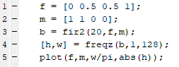

**Explain what each of the above instructions do:**      
- fir2: Matlab built-in function for an FIR arbitrary shape filter design using the frequency sampling method. This designs an Nth order linear phase FIR digital filter with the frequency response specified by vectors f and m and returns the filter coefficients in length N+1 in vector B.    
- freqz ([h,w] = freqz(b,a,n)): A Matlab built-in function that returns the N-point complex frequency response vector h and the n-point frequency vector w, given numerator and denominator coefficients in vectors b and a.    
- abs: gives the absolute value of the elements in X.       
- plot: creates a linear plot based on the inputs given.      

## Procedure
### Task 1:  
Execute the following Matlab instructions to design the above low-pass FIR filter with the requirements: 20th order, 1.25 MHz pass band, 5 MHz clock rate.  

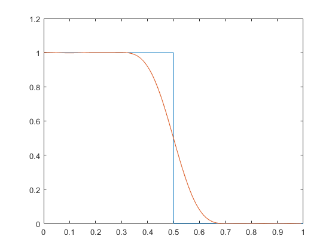  
Figure 7.1 - Frequency response of filter generated with Matlab

**f** : vector of frequency points in range 0 to 1, where 1 corresponds to nyquist frequency. 
**m** : magnitudes at each of the points in f
**b** : 20th order filter coefficients
**w** : frequency response of filter

| Coefficient | Magnitude |
| --- | --- |
| 0 | 0 |
| 1 | 112 |
| 2 | 0 |
| 3 | -389 |
| 4 | 0 |
| 5 | 1107 |
| 6 | 0 |
| 7 | -2796 |
| 8 | 0 |
| 9 | 10172 | 
| 10 | 16356 |
| 11 | 10172 |
| 12 | 0 |
| 13 | -2796 |
| 14 | 0 |
| 15 | 1107 |
| 16 | 0 |
| 17 | -389 |
| 18 | 0 |
| 19 | 113 |


Table 7.1 - 16 bit normalized filter coefficients generated with Matlab

### Task 2, Parallel FIR Filter:  

```VHDL
library IEEE;
use IEEE.STD_LOGIC_1164.ALL;
use ieee.numeric_std.all;

entity fir_parallel is
    Port ( clk : in STD_LOGIC;
           rst : in STD_LOGIC;
           impulse : in integer;
           output : out STD_LOGIC_VECTOR(37 downto 0) );
end fir_parallel;

architecture Behavioral of fir_parallel is

component dds_compiler_0 IS
  PORT (
    aclk : IN STD_LOGIC;
    m_axis_data_tvalid : OUT STD_LOGIC;
    m_axis_data_tdata : OUT STD_LOGIC_VECTOR(7 DOWNTO 0);
    m_axis_phase_tvalid : OUT STD_LOGIC;
    m_axis_phase_tdata : OUT STD_LOGIC_VECTOR(23 DOWNTO 0)
  );
END component dds_compiler_0;

type twenty is array(0 to 19) of integer;
signal h : twenty;
signal reg : twenty := (others => 0);
signal m_axis_data_tvalid, m_axis_phase_tvalid : STD_LOGIC := '1';
signal extend_sine : std_logic_vector(15 downto 0);
signal output_sine : std_logic_vector(7 downto 0);
signal m_axis_phase_tdata : std_logic_vector(23 downto 0);
signal x_in : integer;

begin

dds : dds_compiler_0 port map ( clk, 
                                m_axis_data_tvalid,
                                output_sine,
                                m_axis_phase_tvalid,
                                m_axis_phase_tdata);
 
extend_sine <= (15 downto 8 => output_sine(7)) & output_sine; 
--x_in <= to_integer(signed(extend_sine));   
x_in <= impulse;

h(0) <= 0;
h(1) <= 112;
h(2) <= 0;
h(3) <= -389;
h(4) <= 0;
h(5) <= 1107;
h(6) <= 0;
h(7) <= -2796;
h(8) <= 0;
h(9) <= 10172;
h(10) <= 16356;
h(11) <= 10172;
h(12) <= 0;
h(13) <= -2796;
h(14) <= 0;
h(15) <= 1107;
h(16) <= 0;
h(17) <= -389;
h(18) <= 0;
h(19) <= 113;
       
process(clk,rst)
begin
if rising_edge(clk) then
    if rst = '1' then
        for I in 19 to 0 loop
            reg(I) <= 0;
        end loop;
    else
        reg(19) <= x_in*h(19);
        reg(18) <= x_in*h(18)+reg(19);
        reg(17) <= x_in*h(17)+reg(18);
        reg(16) <= x_in*h(16)+reg(17);
        reg(15) <= x_in*h(15)+reg(16);
        reg(14) <= x_in*h(14)+reg(15);
        reg(13) <= x_in*h(13)+reg(14);
        reg(12) <= x_in*h(12)+reg(13);
        reg(11) <= x_in*h(11)+reg(12);
        reg(10) <= x_in*h(10)+reg(11);
        reg(9) <= x_in*h(9)+reg(10);
        reg(8) <= x_in*h(8)+reg(9);
        reg(7) <= x_in*h(7)+reg(8);
        reg(6) <= x_in*h(6)+reg(7);
        reg(5) <= x_in*h(5)+reg(6);
        reg(4) <= x_in*h(4)+reg(5);
        reg(3) <= x_in*h(3)+reg(4);
        reg(2) <= x_in*h(2)+reg(3);
        reg(1) <= x_in*h(1)+reg(2);
        reg(0) <= x_in*h(0)+reg(1);
        output <= std_logic_vector(to_signed(x_in*h(0) + reg(0),output'length));        
--        for I in 18 to 0 loop
--            reg(I) <= x_in*h(I)+reg(I+1);
--        end loop;
    end if;
end if;
end process;

end Behavioral;
```
### Task 3, Serial FIR Filter:  

```VHDL
library IEEE;
use IEEE.STD_LOGIC_1164.ALL;
use ieee.numeric_std.all;

entity fir_serial is
    Port ( clk : in STD_LOGIC;
           clk21x : in STD_LOGIC;
           rst : in STD_LOGIC;
           impulse : in integer;
           output : out STD_LOGIC_VECTOR(37 downto 0) );
end fir_serial;

architecture Behavioral of fir_serial is

component dds_compiler_0 IS
  PORT (
    aclk : IN STD_LOGIC;
    m_axis_data_tvalid : OUT STD_LOGIC;
    m_axis_data_tdata : OUT STD_LOGIC_VECTOR(7 DOWNTO 0);
    m_axis_phase_tvalid : OUT STD_LOGIC;
    m_axis_phase_tdata : OUT STD_LOGIC_VECTOR(23 DOWNTO 0)
  );
END component dds_compiler_0;

type twenty is array(0 to 19) of integer;
signal h : twenty;
signal reg : twenty := (others => 0);

signal m_axis_data_tvalid, m_axis_phase_tvalid : STD_LOGIC := '1';
signal extend_sine : std_logic_vector(15 downto 0);
signal output_sine : std_logic_vector(7 downto 0);
signal m_axis_phase_tdata : std_logic_vector(23 downto 0);
signal x_in : integer;
signal accum : integer := 0;
signal ct : integer := 0;
signal mult_out : integer;
signal mux_out : integer;

begin
dds : dds_compiler_0 port map ( clk, 
                                m_axis_data_tvalid,
                                output_sine,
                                m_axis_phase_tvalid,
                                m_axis_phase_tdata);
 
extend_sine <= (15 downto 8 => output_sine(7)) & output_sine; 
x_in <= to_integer(signed(extend_sine));   
--x_in <= impulse;

h(0) <= 0;
h(1) <= 112;
h(2) <= 0;
h(3) <= -389;
h(4) <= 0;
h(5) <= 1107;
h(6) <= 0;
h(7) <= -2796;
h(8) <= 0;
h(9) <= 10172;
h(10) <= 16356;
h(11) <= 10172;
h(12) <= 0;
h(13) <= -2796;
h(14) <= 0;
h(15) <= 1107;
h(16) <= 0;
h(17) <= -389;
h(18) <= 0;
h(19) <= 113; 

process(clk,rst)
begin
if rising_edge(clk) then
    if rst = '1' then       
    else
        reg(0) <= x_in;
        for I in 1 to 19 loop
            reg(I) <= reg(I-1);
        end loop;
    end if;
end if;
end process;

process(clk21x)
begin
accum <= reg(ct)*h(ct)+accum;
ct <= ct + 1;
if ct = 19 then
    ct <= 0;
    output <= std_logic_vector(to_signed(accum,output'length));
    accum <= 0; 
end if;
end process;
end Behavioral;
```

### Task 4, IP Filter:
```VHDL
library IEEE;
use IEEE.STD_LOGIC_1164.ALL;

entity fir_ip is
    Port ( clk : in STD_LOGIC;
           rst : in STD_LOGIC;
           impulse : in integer;
           output : out STD_LOGIC_VECTOR(37 downto 0) );
end fir_ip;

architecture Behavioral of fir_ip is
component fir_compiler_0 IS
  PORT (
    aclk : IN STD_LOGIC;
    s_axis_data_tvalid : IN STD_LOGIC;
    s_axis_data_tready : OUT STD_LOGIC;
    s_axis_data_tdata : IN STD_LOGIC_VECTOR(15 DOWNTO 0);
    m_axis_data_tvalid : OUT STD_LOGIC;
    m_axis_data_tdata : OUT STD_LOGIC_VECTOR(31 DOWNTO 0)
  );
END component fir_compiler_0;

component dds_compiler_0 IS
  PORT (
    aclk : IN STD_LOGIC;
    m_axis_data_tvalid : OUT STD_LOGIC;
    m_axis_data_tdata : OUT STD_LOGIC_VECTOR(7 DOWNTO 0);
    m_axis_phase_tvalid : OUT STD_LOGIC;
    m_axis_phase_tdata : OUT STD_LOGIC_VECTOR(23 DOWNTO 0)
  );
END component dds_compiler_0;

signal s_axis_data_tvalid, s_axis_data_tready,m_axis_data_tvalid, m_axis_phase_tvalid : STD_LOGIC := '1';
signal extend_sine : std_logic_vector(15 downto 0);
signal output_fir : std_logic_vector(31 downto 0);
signal output_sine : std_logic_vector(7 downto 0);
signal m_axis_phase_tdata : std_logic_vector(23 downto 0);

begin
fir : fir_compiler_0 port map( clk, 
                               s_axis_data_tvalid, 
                               s_axis_data_tready, 
                               impulse ,
                               m_axis_data_tvalid,
                               output_fir);

dds : dds_compiler_0 port map ( clk, 
                                m_axis_data_tvalid,
                                output_sine,
                                m_axis_phase_tvalid,
                                m_axis_phase_tdata);
                                
extend_sine <= (15 downto 8 => output_sine(7)) & output_sine; 

end Behavioral;

```

### Task 5, Simulation:  
Test parallel, serial and IP filters with a step function, 1.6MHz sine wave and 0.5MHz sine wave. When the input to the filter is a step function, the output should be a sinc function. When the input is 0.5Mhz, the filter should pass this frequency. When the input is 1.6Mhz, the filter should block this frequency because the passband for the filter is 1.25Mhz. Simulation pictures are shown in the results section.

### Task 6:  

### Part VI:  

**Question 1**:
The parallel FIR filter used the most LUTs and flip flops, but did not use any DSP blocks. The IP filter used 20 DSP blocks. The serial filter used 1 DSP block and the least amount of LUTs and flip flops. The serial filter is the best design in terms of area, but it requires a second clock that is 21 times faster than the 5Mhz clock.

**Question 2**:
The DDS IP core synthesized a sine wave at 0.5MHz and 1.6Mhz. The core had to be regenerated each time the frequency was changed for testing. The system clock of the DDS core was 5Mhz, which is the same rate as the clock of the filter and it had 1 channel.

**Question 3**:
The FIR IP used a single rate filter type and a vector source for filter coefficients. The filter coefficients generated from matlab were placed as the coefficient vector in the GUI. The hardware oversampling specification was set to input sample period. This was important to see the correct frequency on the output of the filter. At its default setting, frequency specification, the filter was outputting a slower frequency than the input. The FIR IP used one channel. The coefficient's width was 16 bits and the data input width was also 16 bits. The data output width was set at its max setting which in this case was 32 bits. 

**Question 4**:
The parallel FIR filter used more resources than the serial FIR filter, but could operate much faster. The serial filter required an additional clock at 21 times the speed of the 5Mhz clock because it had to multiply and acummulate 20 times each new sample came in and then output the result on the last clock cycle. The IP filter is optimized for area and speed. It can operate just as fast as the parallel FIR filter, but it requires 20 dsp blocks and less LUTs and flip flops.

**Question 5**:
The serial and aparallel implementations both had outputs of 37 bits. The FIR IP design only had a 32 bit output. 32 bits was the maximum output width for the specified input width in the FIR IP GUI.


## Testing Strategy
There were 3 test inputs to each of the three filter designs for a total of 9 tests. Each filter was tested with a 0.5Mhz sine wave, a 1.6Mhz sine wave and a step function. The simulations showed that each filter performed properly for each test case. The step function was outputted as a sinc function, the 0.Mhz sine wave was passed, and the 1.6Mhz was rejected. 

## Results (Data)

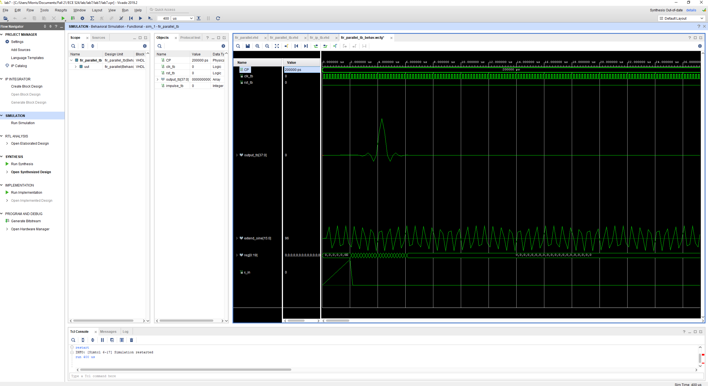  
Figure 7.2 Parallel FIR filter with step function input

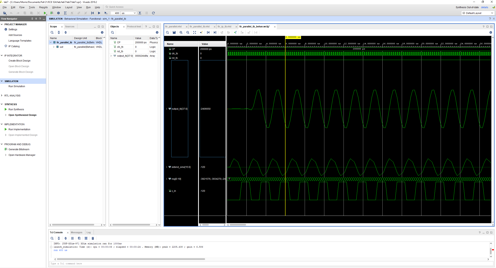  
Figure 7.3 Parallel FIR filter with 0.5Mhz sine wave input

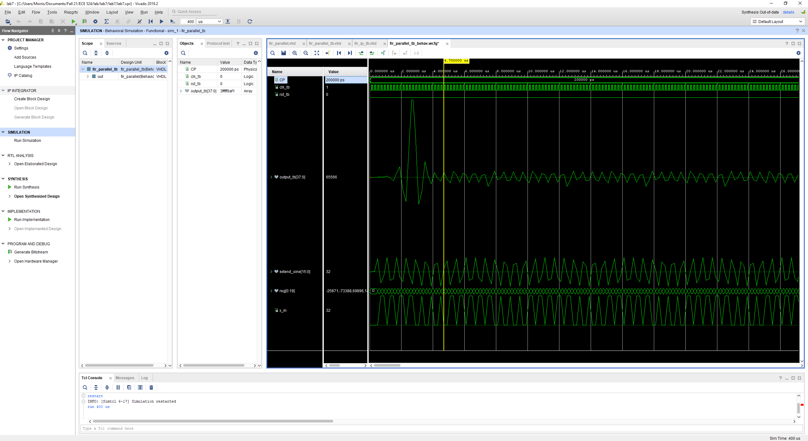  
Figure 7.4 Parallel FIR filter with 1.6Mhz sine wave input

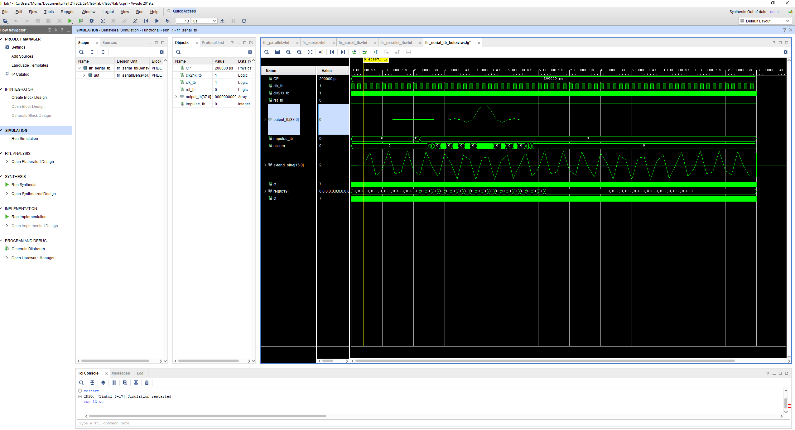  
Figure 7. Serial FIR filter with step function input

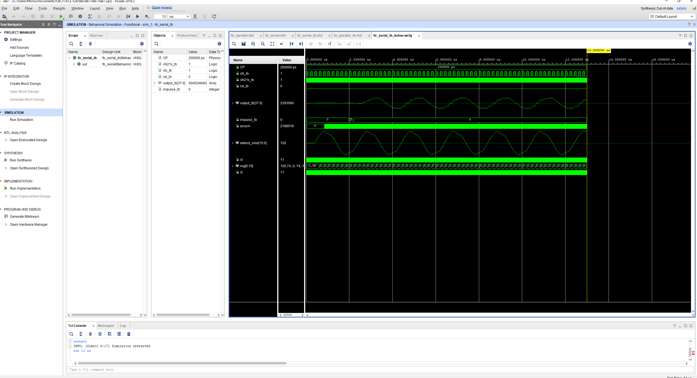  
Figure 7.5 Serial FIR filter with 0.5Mhz sine wave input

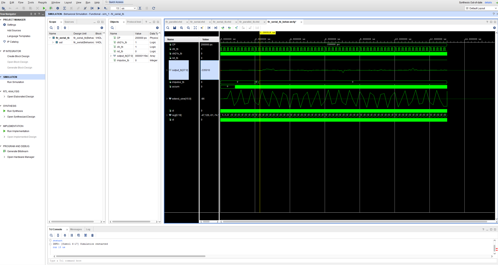  
Figure 7.6 Serial FIR filter with 1.6Mhz sine wave input

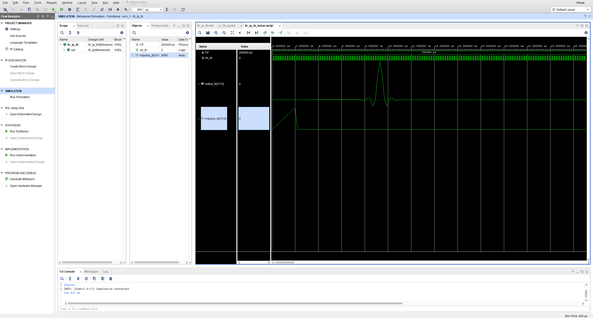  
Figure 7.7 IP FIR filter with step function input

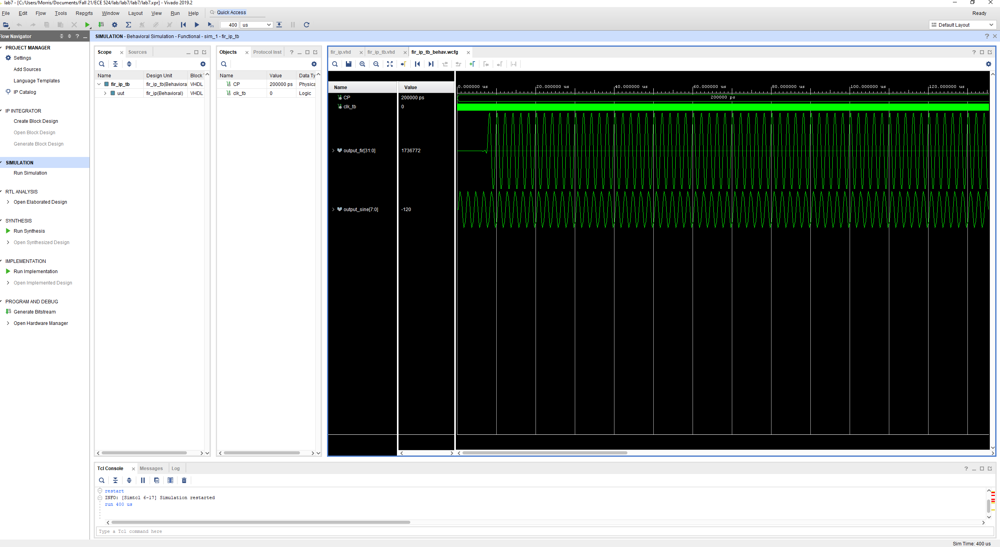  
Figure 7.8 IP FIR filter with 0.5Mhz sine wave input

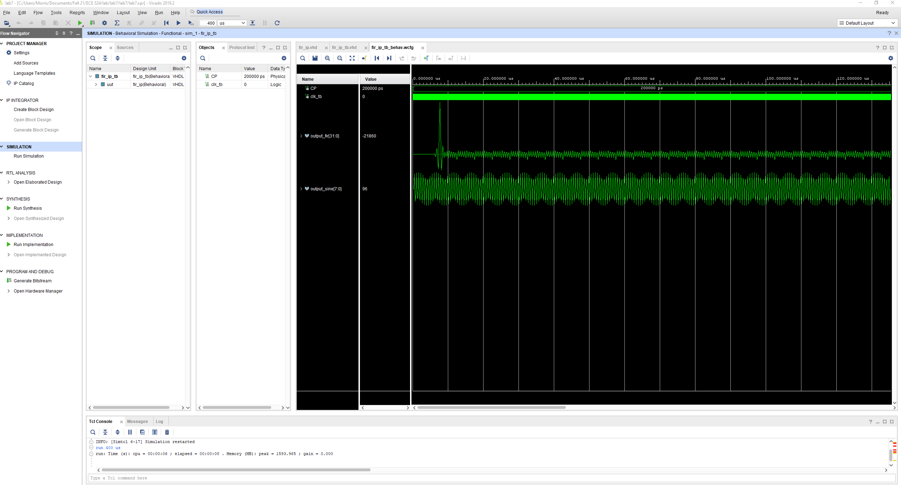  
Figure 7.9 IP FIR filter with 1.6Mhz sine wave input


## FPGA Resources
| Implementation | Flip Flops | LUTs | DSP Blocks |
| --- | --- | --- | --- |
| IP FIR | 495 | 342 | 20 |
| Parallel FIR | 722 | 1094 | 0 |
| Serial FIR | 272 | 207 | 1 |

Table 7.2 - FPGA resource allocation for serial, parallel and IP FIR filters

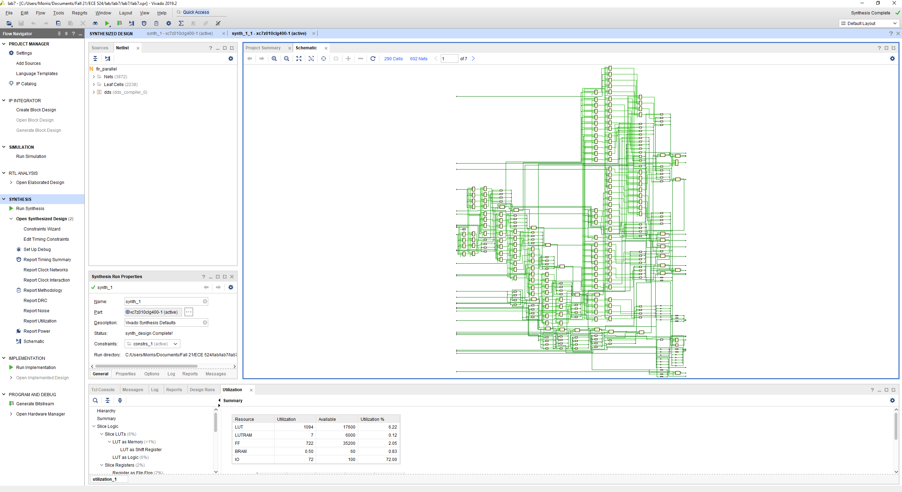  
Figure 7.10 Parallel FIR filter synthesis schematic

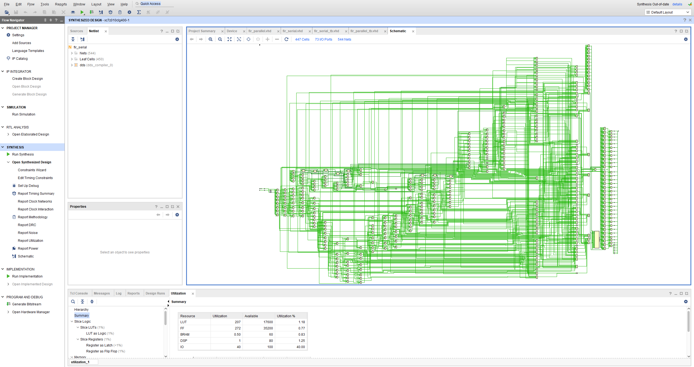  
Figure 7.11 Serial FIR filter synthesis schematic

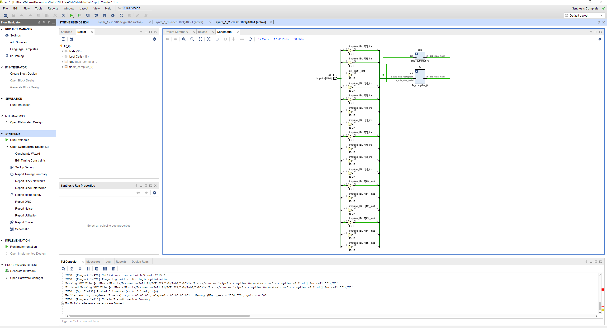  
Figure 7.12 IP FIR filter synthesis schematic


## Conclusion
The tasks for Lab 7 were completed succesfully. We studied three different designs of an FIR low pass filter. The resource utilization from the synthesis showed the area required for each design. This is a good tool to determine which filter design should be selected in application. The main challenge for this lab was the serial FIR implementation. In our design, we used an additional clock that was 21 times the main clock. We are not sure if this is an appropriate solution, but this was the only way we could think of to maintain the frequency of the input signal at the output signal. The use of FIR filters in fpga was explored in this lab in detail by creating both a serial and parallel implemenation of an FIR filter. We now understand the importance of delays, registers and multiply acummulators for filter design in FPGA.

-------------
-------------  

# Is assignment ready for review? Yes
