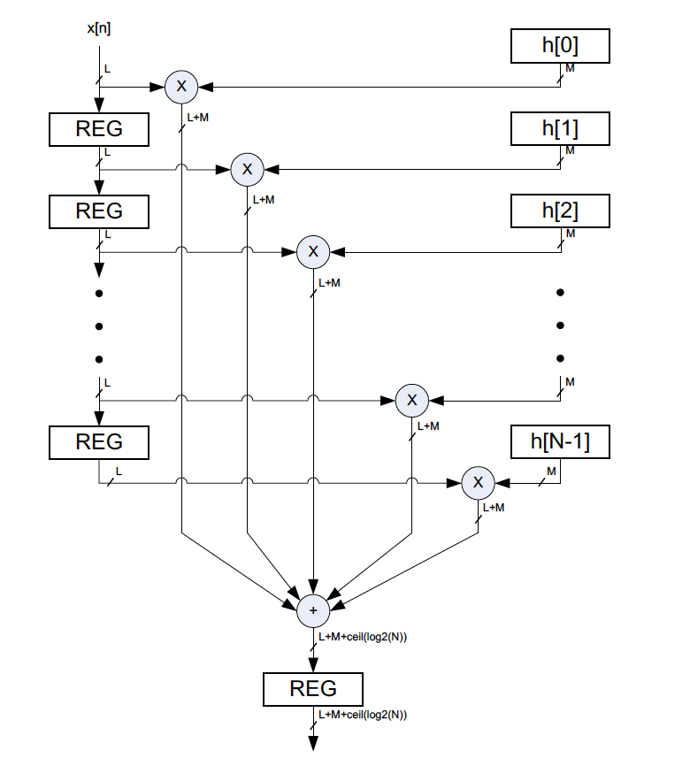
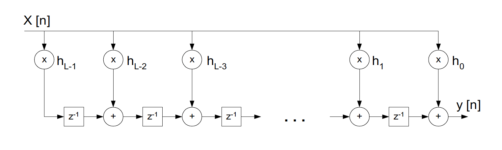
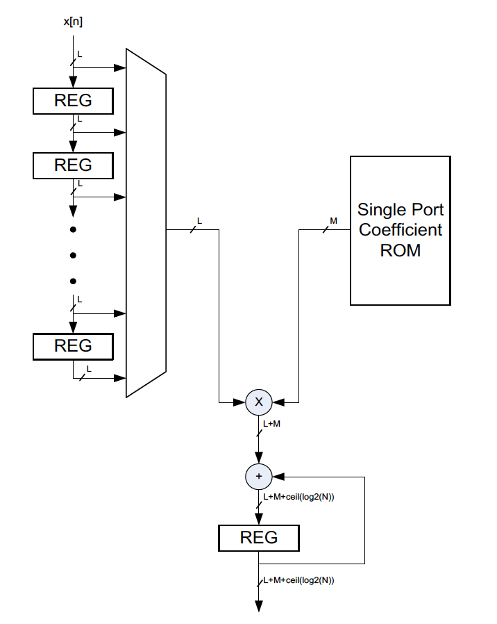

# ECE 524L Fall 2021
**California State University, Northridge**  
**Department of Electrical and Computer Engineering**  

## Lab 7 - Design Space Exploration of FIR Filter

## Objective

After completing this lab, students will be able to:
- Learn the design area/performance trade-offs
- Model and design FIR filters using Matlab 
- Design FIR filter using VHDL and study the trade-offs
- Simulate an FIR digital filter
- Use Vivado IP Integrator tool to create complex IP cores

## Requirements

The following material is required to complete the lab:
- Xilinx Vivado 2019.1

## References

- Xilinx FPGA datasheets (available at http://www.xilinx.com)
- Software Manual (available at http://www.support.xilinx.com)
- VHDL reference guide (available at http://www.acc-eda.com/vhdlref)
- Wikipedia (http://en.wikipedia.org/wiki/Bitonic_sorter)


## Introduction

The goal of this lab will be to implement a digital low pass FIR filter of order M = 20 on FPGA. Initially we will model this filter by Matlab and will create the coefficients. We then export the coefficients to Vivado tools and will create the filter using FPGA design tools. This is followed by implementing the design and simulating it for correct functionality. We will explore the design space by applying different optimization algorithms and study the design trade-offs for area and performance. At the end we will compare the simulation of the FIR filter using both Matlab and HDL simulator. 

The equation to implement a FIR filter is given as:


Where:  
- y: output  
- x: input  
- h: filter coefficients a.k.a filter taps  
- N: number of coefficients   

Figure 7.1 shows the direct implementation of the FIR filter. 



Figure 7.1 Direct implementation of FIR filter

A Direct form implementation of an FIR filter performs a weighted sum with the incoming samples of the input signal. This translates to multipliers, adders (multiply-accumulator or MACC), and registers. Filter coefficients can be stored into memory (registers or ROM). Input and output are sampled every clock cycle. To achieve highest performance, one multiplier per tap is needed and an N-input adder tree can be used to produce final result. In Figure 7.1, x[n] is the input, h[n] represents filter coefficient and y[n] represents the output. Note the bit growth on the accumulator output. 

The parallel implementation shown in Figure 7.1 can be optimized for performance. The adder tree in Figure 7.1 accepts 20 inputs. This can be implemented using 5 levels of addition in the best case which still imposes a long propagation delay on the output. This can be improved by using the transposed direct implementation depicted in Figure 7.2 where the propagation delay has been optimized with the same functionality.



Figure 7.2 The transposed direct form of FIR filter

The parallel implementation shown in Figure 7.1 is optimized for area. An alternative serial implementation of the FIR filter in Figure 7.1 is shown in Figure 7.3 where FIR filter is optimized for area. In this implementation, input and output are sampled every N clocks. This implementation needs only one multiplier, one two input adder, (multiply-accumulator or MACC). The bit growth on the output accumulator output is the same as the first implementation.



Figure 7.3 Serial Implementation of FIR filter

In the following steps, we will implement different variations of the FIR filter presented above and study the design trade-offs. 

## Procedure

### Part I – FIR filter coefficients

:point_right: **Task 1:** Execute the following Matlab instructions to design the above low-pass FIR filter with the requirements: 20th order, 1.25 MHz pass band, 5 MHz clock rate. 

```matlab
f = [0 0.5 0.5 1];
m =[1 1 0 0];
b = fir2(20, f, m);
[h, w] = freqz(b, 1, 128);
plot(f, m, w/pi, abs(h));
```

Include the frequency response plot in your prelab 1. Keep in mind that the frequencies in these Matlab instructions assumed to be normalized. What are the passband and stopband actual frequencies and the normalized frequencies? (Prelab 1) Use the following equation to convert the frequency to the normalized frequency.

```matlab
f (Hz) * 2 / f (sample) = f (normalized)
```

Explain what each of the above instructions do (Prelab 1). You can use the Matlab instruction:

```matlab
doc instruction
```

where `instruction` is a matlab instruction. The output will be the description of Matlab instruction.  

Obtain the FIR filter coefficients that includes normalized integer coefficients of 16 bits using the following formula (Prelab 1):  

```matlab
coef (normalized) = coeff * (32767 / sum(coeff))
```

Include the frequency response of the FIR filter generated by Matlab in your report (Prelab 1). This is needed later for comparison with FPGA implementation of the FIR filter.  
  
### Part II – FIR filter parallel implementation

Figure 7.2 shows the parallel implementation of the FIR filter. This architecture uses multiple adders and multipliers.   

:point_right: **Task 2:** Develop VHDL source code for the design (prelab 1). Create a Vivado project and using the coefficient set that you generated in part I, implement the FIR filter. Note the bit growth on the output accumulator output. Compile the design and prepare to write a VHDL testbench in part V.

### Part III – FIR filter serial implementation

Figure 7.3 shows the serial implementation of the FIR filter. This architecture uses one adder and one multiplier. 

:point_right: **Task 3:** Develop VHDL source code for the design (prelab 1). Create a Vivado project and using the coefficient set you generated in part I, implement the FIR filter. Note the bit growth on the output accumulator output. Compile the design and prepare to write a VHDL testbench in part V.

### Part IV – FIR filter systolic architecture implementation using IP Integrator

:point_right: **Task 4:** Create a Vivado project and open IP catalogue. Open FIR compiler GUI under "Digital Signal Processing" folder and load the coefficients you found in part I (either as a vector or as a COE file) to generate FIR core with the following specification. Make sure other selections are set to default and not changed.

| Setting | Value |
| -- | -- |
| Filter Type | Single rate |
| Hardware oversampling specification | Select Format -> Input Sample Period |
| Sample Period (Clock Cycles) | 1  
| Filter Architecture | Systolic Multiply Accumulate
| Coefficient Options | Width: 16 bits, singed integer |
| Datapath Option | 16 bit signed inputs, full precision |
| Frequency Response | Passband range: 0 - 0.5<br/>Stopband range: 0.5 – 1 |

Create the core and instantiate it in your design (prelab 1). Note the bit growth on the output accumulator output. Compile the design and prepare to write a VHDL testbench in part V.

### Part V – FIR filter simulation

In this part you are required to verify FIR functionality using VHDL testbench. Simulation is done in two phases. 

:point_right: **Task 5:** Impulse response verification: Use a step function to stimulate the FIR design and include the response graph in your report. What do you expect as a response to the impulse function for a symmetric FIR filter? (Prelab 2)

:point_right: **Task 6:** Obtain FIR output for two frequencies: 1.6 MHz and 500 KHz inputs. Use MATLAB or Vivado IP integrator tool to create two DDS (Direct Digital Synthesizer) cores to generate sine waves with output frequencies of 1.6 MHz and 500 KHz. The core parameters in the GUI can be set somehow that the block accepts only system clock as input (5 MHz) and it can generate sine waves with different frequencies (1.6 MHz and 500 KHz). The DDS core provides the input sine wave that can feed the FIR filter with these two frequencies. Create a VHDL testbench that generates 5 MHz system clock and simulate your design for correct functionality. Show the result of your simulation to the instructor to receive full credit for the verification of your design. (Prelab 2)

You should provide 9 simulations waveforms in your lab report: 3 for impulse response (parallel, serial and IP core implementations) and 3 for bandpass  (parallel, serial and IP core implementations) and 3 for stopband  (parallel, serial and IP core implementations). However the same simulation source can be reused with slight modification. (Testbench source code should be developed as prelab 2) 

### Part VI – Questions and analysis of the results

:question: **Question 1:** Compare FPGA area (FFs, LUTs, DSP blocks, …), throughput (bandwidth), and latency of all architectures and study the trade-offs. You can find out part of the answers to these questions from the simulation result.

:question: **Question 2:** Explain your procedure to create DDS IP to generate two different frequencies of 1.6 MHz and 500 KHz. Present your DDS core GUI settings and calculations (if any). Insert all GUI settings in your report here.

:question: **Question 3:** Insert all GUI settings for FIR IP that you created using IP integrator tool in your report here.

:question: **Question 4:** Discuss the trade-offs based on your lab results. State advantages and disadvantages of each of the three architecture revisions.

:question: **Question 5:** Compare your designs (both serial and parallel implementation) with IP integrator FIR core in terms of output bit-width. How are they different? 
